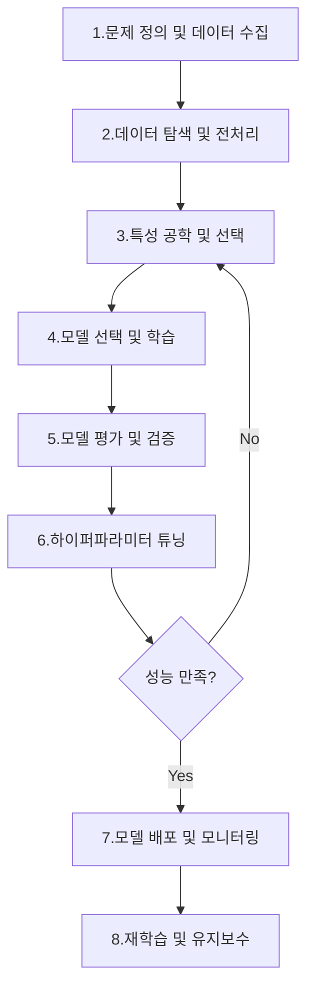
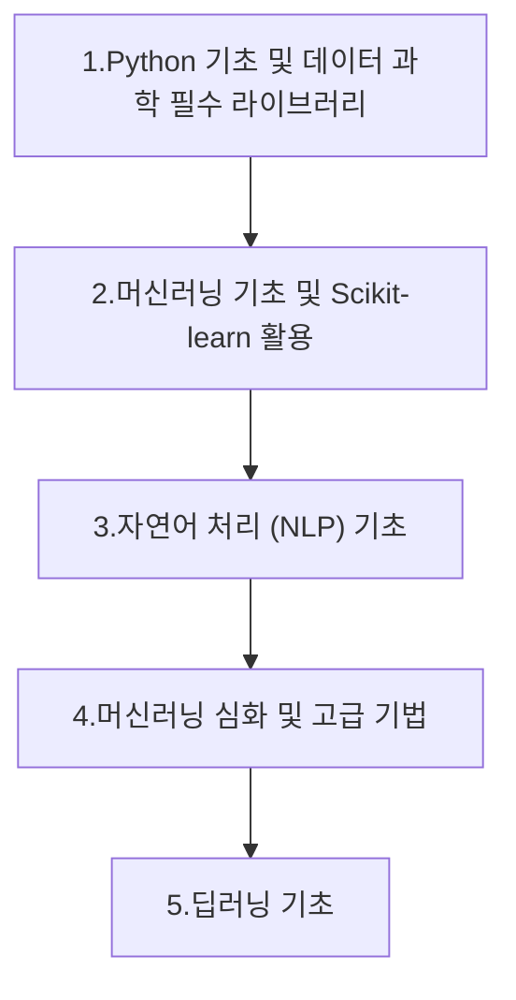

# 머신러닝 학습 가이드라인 (Machine Learning Guideline)

이 문서는 머신러닝의 핵심 개념부터 실제 프로젝트 적용까지 필요한 지식과 실무 팁을 제공합니다. 부트캠프에서 학습한 내용을 바탕으로, 머신러닝 워크플로우를 이해하고, 다양한 알고리즘과 기법을 효과적으로 활용하는 데 도움이 되기를 바랍니다.

## 목차 (Table of Contents)
*   [머신러닝 학습 자료](#머신러닝-학습-자료)
*   [머신러닝 워크플로우 (Machine Learning Workflow)](#머신러닝-워크플로우-machine-learning-workflow)
*   [머신러닝 학습 로드맵 (Machine Learning Learning Roadmap)](#머신러닝-학습-로드맵-machine-learning-learning-roadmap)
*   [개발 환경 설정 (Development Environment Setup)](#개발-환경-설정-development-environment-setup)
*   [실전 프로젝트 예시 (Practical Project Examples)](#실전-프로젝트-예시-practical-project-examples)
*   [머신러닝 윤리 및 공정성 (ML Ethics and Fairness)](#머신러닝-윤리-및-공정성-ml-ethics-and-fairness)
*   [문제 해결 및 일반적인 함정 (Troubleshooting & Common Pitfalls)](#문제-해결-및-일반적인-함정-troubleshooting--common-pitfalls)
*   [추천 도서 (Recommended Books)](#추천-도서-recommended-books)
---

## 머신러닝 학습 자료

| 주제 | 관련 파일 | 핵심 개념 |
|---|---|---|
| **1. Pandas 라이브러리 기초 및 심화** | 0701정리.md, 0702정리.md | Series, DataFrame, 데이터 로딩/저장, 탐색, 전처리, 특성 공학, 시각화 연동, 조건부 검색, 통계 함수, 결측치 처리 |
| **2. 데이터 전처리** | 0703정리.md | 결측치/중복 데이터 처리, Min-Max 정규화, Z-score 표준화, Robust 스케일링, 구간화(Binning), 원-핫 인코딩 |
| **3. 한국어 자연어 처리 및 텍스트 시각화** | 0704정리.md | KoNLPy, 형태소 분석(Kkma, Hannanum, Okt), 워드클라우드, 한글 폰트 설정, 불용어 제거, 마스크 이미지 활용 |
| **4. 모델링 워크플로우 및 주요 알고리즘** | 0707정리.md | 데이터 준비, 데이터셋 분할, 알고리즘 선택/학습/예측/평가, 분류(KNN, 로지스틱 회귀, 의사결정트리, 랜덤포레스트, Gradient Boosting, SVM), 회귀(선형 회귀, KNN 회귀), 다중 레이블 분류, 과적합 방지(규제: Ridge, Lasso, ElasticNet) |
| **5. 모델 비교 분석** | 0708정리.md | 모델 성능 비교(회귀/분류), 이미지 데이터 처리(PIL, NumPy), 딥러닝(CNN, 데이터 증강, 전이 학습) 필요성 |
| **6. 핵심 개념: 지도/비지도 학습, 스케일링, SVM, 이상치 처리** | 0709정리.md | 지도 학습, 비지도 학습, 데이터 스케일링(StandardScaler, RobustScaler, MinMaxScaler, Normalizer), 서포트 벡터 머신(SVM), IQR 방법 이상치 탐지/처리 |
| **7. 군집 분석, 차원 축소 (PCA) 및 교차 검증** | 0710정리.md | 군집 분석(K-Means 클러스터링), 차원 축소(PCA), 차원의 저주, 다중공선성 해결, 교차 검증(K-Fold, Stratified K-Fold) |
| **8. 모델 최적화: 범주형 데이터 처리, 하이퍼파라미터 튜닝** | 0714정리.md | 범주형 데이터 처리(pd.get_dummies, OneHotEncoder, ColumnTransformer), 하이퍼파라미터 튜닝(GridSearchCV), 과적합 감지/방지 전략 |
| **9. 모델 최적화: 하이퍼파라미터 튜닝과 Pipeline 활용** | 0715정리.md | 하이퍼파라미터 최적화(Grid Search, Random Search, 베이즈 최적화: Optuna), Scikit-learn Pipeline(Pipeline + GridSearchCV, Pipeline + Optuna) |
| **10. 모델 평가, 데이터 시각화, NLP 종합** | 0716정리.md | 모델 평가 지표(분류: 혼동 행렬, 정확도, 정밀도, 재현율, F1, ROC-AUC; 회귀: MAE, MSE, RMSE, R²), Matplotlib, Seaborn, NLP(텍스트 전처리, 벡터화: CountVectorizer, TF-IDF, KoNLPy), 감정 분석 모델 구축 |

---

## 머신러닝 워크플로우 (Machine Learning Workflow)

머신러닝 프로젝트는 단순히 모델을 학습하는 것을 넘어, 데이터의 생애 주기 전반에 걸쳐 체계적인 단계를 따릅니다.



#### 1. 문제 정의 및 데이터 수집 (Problem Definition & Data Collection)
*   **목표**: 비즈니스/연구 문제 명확화 및 **필요 데이터 확보**

*   **주요 활동**:
    *   **문제 유형 식별** (분류, 회귀, 군집 등)
    *   **데이터 소스 파악** 및 **수집 계획 수립**

*   **핵심**: 모델 성능은 **데이터 품질과 양**에 좌우되므로, **신뢰할 수 있는 데이터 확보**가 중요합니다

#### 2. 데이터 탐색 및 전처리 (EDA & Preprocessing)
*   **목표**: 데이터 이해 및 **모델 학습 적합 형태로 가공**

*   **주요 활동**:
    *   **탐색적 데이터 분석 (EDA)**: **데이터 구조, 통계, 분포, 결측치, 이상치 파악**
    *   **결측치 처리**: **누락 데이터 제거** (`dropna()`) 또는 **대체** (`fillna()`)
    *   **중복 제거**: **중복 데이터 식별 및 제거** (`drop_duplicates()`)
    *   **스케일링**: **특성 스케일 통일** (`MinMaxScaler`, `StandardScaler`)로 **모델 안정성/성능 향상**

*   **핵심**: **데이터 품질 향상**으로 **모델 성능과 안정성 증대**

#### 3. 특성 공학 및 선택 (Feature Engineering & Selection)
*   **목표**: 모델 예측 성능 향상을 위한 **유의미한 특성 생성** 또는 **불필요 특성 제거**

*   **주요 활동**:
    *   **특성 생성**: **기존 특성 조합/변환**으로 **새로운 특성 도출**
    *   **인코딩**: **범주형 데이터 변환** (`OneHotEncoder`, `LabelEncoder`)
    *   **차원 축소**: **PCA** 등으로 **데이터 차원 축소** 및 **주요 정보 보존**
    *   **특성 선택**: **통계/모델 기반**으로 **예측에 중요한 특성 선별**

*   **핵심**: **도메인 지식과 창의성**으로 **모델 성능 혁신적 개선 가능**

#### 4. 모델 선택 및 학습 (Model Selection & Training)
*   **목표**: 문제에 **최적화된 알고리즘 선택** 및 **훈련 데이터로 모델 학습**

*   **주요 활동**:
    *   **데이터 분할**: **훈련, 검증, 테스트 세트 분할** (`train_test_split`)
    *   **알고리즘 선택**: **문제 유형에 맞는 알고리즘 선정**
    *   **모델 학습**: **훈련 세트로 모델 학습** (`fit`)

*   **핵심**: **다양한 모델 시도** 및 **데이터 특성에 맞는 최적 모델 선택**이 중요

#### 5. 모델 평가 및 검증 (Model Evaluation & Validation)
*   **목표**: **학습된 모델의 객관적 성능 평가** 및 **일반화 능력 확인**

*   **주요 활동**:
    *   **평가 지표 선택**: **분류** (정확도, 정밀도, 재현율, F1, ROC-AUC), **회귀** (MAE, MSE, RMSE, R²) 등 **적절한 지표 사용**
    *   **교차 검증**: `K-Fold`, `Stratified K-Fold` 등으로 **일반화 성능 신뢰도 평가**
    *   **과적합/과소적합 진단**: **훈련/테스트 성능 비교**로 **모델 상태 진단**

*   **핵심**: **모델 강점/약점 파악** 및 **개선 방향 설정**

#### 6. 하이퍼파라미터 튜닝 (Hyperparameter Tuning)
*   **목표**: **모델 성능 극대화**를 위한 **하이퍼파라미터 최적화**

*   **주요 활동**:
    *   **튜닝 기법**: `GridSearchCV`, `RandomizedSearchCV`, **베이즈 최적화** (`Optuna`) 등으로 **최적 조합 탐색**
    *   **규제**: `Ridge`, `Lasso` 등으로 **모델 복잡도 제어** 및 **과적합 방지**

*   **핵심**: **모델 성능 미세 조정** 및 **일반화 능력 향상**에 필수

#### 7. 모델 배포 및 모니터링 (Model Deployment & Monitoring)
*   **목표**: **검증된 모델을 실제 서비스에 적용**하고 **지속적으로 성능 관리**

*   **주요 활동**:
    *   **모델 API 배포** 또는 **웹 애플리케이션 통합**
    *   **실시간 예측 성능 모니터링** 및 **데이터 드리프트 알림**

*   **핵심**: **모델이 실제 환경에서 지속적으로 가치를 창출하도록 관리**

#### 8. 재학습 및 유지보수 (Retraining & Maintenance)
*   **목표**: **모델 성능 저하 방지**, **새로운 데이터 패턴 학습**, **모델 최신 상태 유지**

*   **주요 활동**:
    *   **주기적 새 데이터로 모델 재학습**
    *   **성능 저하 감지 시 모델 업데이트**

*   **핵심**: **머신러닝 모델은 지속적인 관리가 필요합니다**

---

## 머신러닝 학습 로드맵 (Machine Learning Learning Roadmap)

머신러닝을 효과적으로 학습하기 위한 단계별 로드맵입니다. 각 단계는 이전 지식을 기반으로 심화되며, 실습을 통해 이론을 적용하는 것이 중요합니다.





### 1단계: Python 기초 및 데이터 과학 필수 라이브러리
*   **Python 프로그래밍**: 변수, 자료구조, 조건문, 반복문, 함수, 클래스 등 기본 문법
*   **NumPy**: 과학 계산을 위한 핵심 라이브러리 (배열 연산, 벡터화)
*   **Pandas**: 데이터 분석 및 조작을 위한 핵심 라이브러리 (Series, DataFrame, 데이터 전처리, 집계 및 그룹화)
*   **Matplotlib & Seaborn**: 데이터 시각화 라이브러리 (다양한 차트, 스타일 설정)

### 2단계: 머신러닝 기초 및 Scikit-learn 활용
*   **머신러닝 개요**: 지도 학습(분류, 회귀), 비지도 학습(군집, 차원 축소) 개념
*   **Scikit-learn 핵심 기능**:
    *   **데이터 전처리**: 스케일링(`StandardScaler`, `MinMaxScaler`), 인코딩(`OneHotEncoder`, `LabelEncoder`)
    *   **주요 알고리즘**:
        *   **분류**: KNN, 로지스틱 회귀, 의사결정트리, 랜덤포레스트, SVM
        *   **회귀**: 선형 회귀, KNN 회귀
        *   **군집**: K-Means
        *   **차원 축소**: PCA
    *   **모델 평가**: 정확도, 정밀도, 재현율, F1-score, ROC-AUC, 혼동 행렬, MAE, MSE, R²
    *   **모델 선택 및 튜닝**: 교차 검증(`KFold`), 하이퍼파라미터 튜닝(`GridSearchCV`)
    *   **파이프라인**: 전처리 및 모델링 통합(`Pipeline`, `ColumnTransformer`)

### 3단계: 자연어 처리 (NLP) 기초
*   **NLP 개요**: 텍스트 데이터의 특성 및 NLP 워크플로우 이해
*   **텍스트 전처리**: 정규화, 토큰화, 불용어 제거
*   **텍스트 벡터화**: `CountVectorizer`, `TF-IDF`
*   **한국어 NLP**: **KoNLPy** 라이브러리를 이용한 형태소 분석
*   **텍스트 시각화**: `WordCloud` (워드클라우드)
*   **응용**: 감정 분석 등 텍스트 분류 모델 구축

### 4단계: 머신러닝 심화 및 고급 기법
*   **과적합/과소적합**: 개념, 탐지, 방지 전략 (규제 - `Ridge`, `Lasso`, 조기 종료)
*   **앙상블 기법**: Voting, Bagging, Stacking
*   **하이퍼파라미터 최적화**: **베이즈 최적화** (`Optuna`)
*   **모델 해석**: 특성 중요도, SHAP, LIME
*   **성능 모니터링**: 배포된 모델의 성능 관리

### 5단계: 딥러닝 기초 (선택 사항, 권장)
*   **신경망 기초**: 퍼셉트론, 다층 퍼셉트론, 활성화 함수, 손실 함수, 역전파
*   **딥러닝 프레임워크**: TensorFlow/Keras 또는 PyTorch
*   **CNN**: 이미지 분류를 위한 합성곱 신경망
*   **RNN/LSTM**: 시퀀스 데이터(텍스트, 시계열) 처리를 위한 순환 신경망
*   **전이 학습**: 사전 학습된 모델 활용


---

## 개발 환경 설정 (Development Environment Setup)

머신러닝 프로젝트를 효율적으로 수행하기 위한 개발 환경 설정은 매우 중요합니다. 안정적이고 생산적인 환경은 학습 및 개발 과정의 효율성을 높여줍니다.

### 1. Python 설치 및 버전 관리
*   **Python**: 최신 안정 버전 (Python 3.8 이상 권장) 설치.
*   **Anaconda/Miniconda**: 가상 환경 관리 및 패키지 설치를 위한 도구. `conda`를 사용하여 독립적인 환경을 구축하고 관리하는 것을 권장합니다.
    ```bash
    conda create -n ml_env python=3.9
    conda activate ml_env
    ```

### 2. 필수 라이브러리 설치
주요 머신러닝 및 데이터 과학 라이브러리를 설치합니다.
```bash
pip install numpy pandas matplotlib seaborn scikit-learn jupyterlab konlpy plotly optuna
```

### 3. 통합 개발 환경 (IDE)
*   **JupyterLab/Jupyter Notebook**: 데이터 탐색, 모델 프로토타이핑, 시각화에 최적화된 웹 기반 환경.
*   **VS Code (Visual Studio Code)**: 다양한 확장 프로그램(Python, Jupyter, Git 등)을 통해 강력한 개발 환경 제공.
*   **PyCharm**: Python 개발에 특화된 강력한 IDE.

---

## 실전 프로젝트 예시 (Practical Project Examples)

이론 학습 후 실제 프로젝트에 적용하는 것은 머신러닝 역량을 강화하는 가장 좋은 방법입니다. 다음은 다양한 문제 유형에 대한 간략한 프로젝트 예시입니다.

### 1. 분류 (Classification) 프로젝트: 타이타닉 생존자 예측
*   **목표**: 승객의 특성(성별, 나이, 객실 등급 등)을 기반으로 타이타닉호 침몰 시 생존 여부 예측.
*   **주요 단계**: 데이터 전처리(결측치, 범주형 인코딩), 특성 공학(가족 수, 호칭), 모델 학습(로지스틱 회귀, 랜덤 포레스트), 성능 평가(정확도, 정밀도, 재현율).
*   **데이터셋**: Kaggle의 Titanic: Machine Learning from Disaster

### 2. 회귀 (Regression) 프로젝트: 주택 가격 예측
*   **목표**: 주택의 다양한 특성(면적, 방 개수, 위치 등)을 기반으로 주택 가격 예측.
*   **주요 단계**: 데이터 탐색(이상치, 분포), 특성 스케일링, 선형 회귀 또는 트리 기반 모델 학습, 성능 평가(MAE, RMSE, R²).
*   **데이터셋**: Boston Housing Dataset (Scikit-learn 내장) 또는 Kaggle의 House Prices - Advanced Regression Techniques

### 3. 군집 (Clustering) 프로젝트: 고객 세분화
*   **목표**: 고객의 구매 패턴이나 행동 데이터를 기반으로 유사한 고객 그룹(세그먼트) 식별.
*   **주요 단계**: 데이터 전처리(스케일링), 차원 축소(PCA), K-Means 클러스터링 적용, 군집 결과 시각화 및 해석.
*   **데이터셋**: UCI Machine Learning Repository의 Wholesale customers Data Set

---

## 머신러닝 윤리 및 공정성 (ML Ethics and Fairness)

머신러닝 모델 개발 및 배포 시 윤리적 고려사항과 공정성은 매우 중요합니다. 모델이 사회에 미치는 영향을 이해하고, 잠재적인 편향을 완화하기 위한 노력이 필요합니다.

### 1. 데이터 편향 (Data Bias)
*   **개념**: 훈련 데이터에 특정 그룹에 대한 불균형하거나 편향된 정보가 포함되어 모델이 차별적인 예측을 할 수 있는 현상.
*   **예시**: 특정 인종/성별에 대한 대출 승인율 차이, 얼굴 인식 시스템의 낮은 인식률.
*   **대응**: 데이터 수집 단계부터 다양성 확보, 편향된 데이터 증강/샘플링, 공정성 지표를 통한 모니터링.

### 2. 모델 공정성 지표 (Fairness Metrics)
*   **개념**: 모델의 예측이 특정 그룹에 대해 공정한지 측정하는 지표.
*   **주요 지표**:
    *   **Disparate Impact**: 특정 그룹의 긍정 예측 비율이 다른 그룹에 비해 현저히 낮은지.
    *   **Equal Opportunity**: 참 긍정률(True Positive Rate)이 그룹 간에 동일한지.
    *   **Predictive Parity**: 긍정 예측의 정밀도(Precision)가 그룹 간에 동일한지.

### 3. 설명 가능성 (Explainability)
*   **개념**: 모델의 예측 결과를 사람이 이해할 수 있도록 설명하는 능력. '블랙박스' 모델의 의사결정 과정을 투명하게 만듭니다.
*   **도구**: SHAP (SHapley Additive exPlanations), LIME (Local Interpretable Model-agnostic Explanations).

---

## 문제 해결 및 일반적인 함정 (Troubleshooting & Common Pitfalls)

머신러닝 프로젝트 진행 중 흔히 발생하는 문제점과 그 해결 전략을 이해하는 것은 효율적인 개발에 필수적입니다.

### 1. 과적합 (Overfitting)
*   **증상**: 훈련 데이터에서는 높은 성능을 보이지만, 새로운(테스트) 데이터에서는 성능이 현저히 떨어지는 경우.
*   **원인**: 모델 복잡도가 너무 높거나, 훈련 데이터의 양이 부족한 경우.
*   **해결 전략**:
    *   **데이터 증강**: 훈련 데이터의 양을 늘립니다.
    *   **특성 선택/차원 축소**: 불필요한 특성을 제거하거나 차원을 줄입니다.
    *   **규제 (Regularization)**: 모델의 복잡도를 제한합니다 (L1, L2 규제).
    *   **교차 검증**: 모델의 일반화 성능을 정확히 평가합니다.
    *   **조기 종료 (Early Stopping)**: 검증 성능이 더 이상 개선되지 않을 때 훈련을 중단합니다.

### 2. 과소적합 (Underfitting)
*   **증상**: 훈련 데이터와 테스트 데이터 모두에서 모델 성능이 낮은 경우. 모델이 데이터의 패턴을 충분히 학습하지 못함.
*   **원인**: 모델 복잡도가 너무 낮거나, 특성이 부족한 경우.
*   **해결 전략**:
    *   **모델 복잡도 증가**: 더 복잡한 모델을 사용하거나, 모델의 파라미터를 늘립니다.
    *   **특성 공학**: 새로운 유의미한 특성을 생성합니다.
    *   **하이퍼파라미터 튜닝**: 모델의 학습률 등을 조정하여 더 잘 학습하도록 합니다.

### 3. 데이터 불균형 (Imbalanced Data)
*   **증상**: 특정 클래스의 데이터 수가 다른 클래스에 비해 현저히 적은 경우 (예: 사기 탐지, 희귀 질병 진단).
*   **문제점**: 모델이 다수 클래스에 편향되어 소수 클래스를 제대로 예측하지 못함.
*   **해결 전략**:
    *   **오버샘플링 (Oversampling)**: 소수 클래스 데이터를 증식합니다 (SMOTE 등).
    *   **언더샘플링 (Undersampling)**: 다수 클래스 데이터를 줄입니다.
    *   **클래스 가중치 (Class Weighting)**: 손실 함수에서 소수 클래스에 더 높은 가중치를 부여합니다.
    *   **평가 지표 변경**: 정확도 대신 정밀도, 재현율, F1-score, ROC-AUC 등 사용.

---

## 추천 도서 (Recommended Books)

머신러닝 학습에 도움이 될 만한 추천 도서 목록입니다. 각자의 학습 스타일과 목표에 맞춰 선택하세요.

| 카테고리 (Category) | 도서명 (Title) | 저자 (Author) | 특징 (Features) |
|---|---|---|---|
| **머신러닝 기초 및 실습** | 핸즈온 머신러닝 (Hands-On Machine Learning with Scikit-Learn, Keras & TensorFlow) | Aurélien Géron | Scikit-learn부터 TensorFlow/Keras를 이용한 딥러닝까지 다루는 실용적인 가이드북입니다. 코드 예제가 풍부하여 실습하며 배우기에 좋으며, 입문자에게 강력 추천합니다. |
|  | 파이썬 라이브러리를 활용한 머신러닝 (Introduction to Machine Learning with Python) | Andreas C. Müller, Sarah Guido | Scikit-learn을 중심으로 머신러닝의 기본 개념과 알고리즘을 설명합니다. 코드와 함께 각 알고리즘의 작동 방식을 쉽게 설명하여 초보자에게 적합합니다. |
| **머신러닝 이론 및 통계적 배경** | 통계적 학습의 요소 (The Elements of Statistical Learning) | Trevor Hastie, Robert Tibshirani, Jerome Friedman | 통계학적 관점에서 머신러닝의 이론적 배경을 깊이 있게 다루는 교과서입니다. 수학적 지식이 요구되지만, 알고리즘의 원리를 심층적으로 이해하고자 하는 학습자에게 유용합니다. |
|  | 패턴 인식과 머신러닝 (Pattern Recognition and Machine Learning) | Christopher Bishop | 베이즈 관점에서 패턴 인식과 머신러닝의 기초 이론을 상세히 설명합니다. 다양한 알고리즘의 수학적 기반을 탄탄하게 다질 수 있습니다. |
| **딥러닝** | 밑바닥부터 시작하는 딥러닝 (Deep Learning from Scratch) | 齋藤康毅 | 딥러닝의 핵심 개념을 NumPy만으로 직접 구현하며 이해할 수 있도록 돕는 시리즈입니다. 딥러닝의 내부 작동 원리를 깊이 있게 파악하고 싶은 학습자에게 추천합니다. |
|  | 파이토치 딥러닝 마스터 (Deep Learning with PyTorch) | Eli Stevens, Luca Antiga, Thomas Viehmann | PyTorch 프레임워크를 사용하여 딥러닝 모델을 구축하는 방법을 실용적으로 설명합니다. PyTorch를 배우고자 하는 학습자에게 좋은 선택입니다. |
| **자연어 처리 (NLP)** | 모두의 딥러닝 (Everyone's Deep Learning) | 김성훈 | 딥러닝 기초부터 NLP, 컴퓨터 비전 등 다양한 응용 분야를 쉽게 설명하는 강의록 기반의 도서입니다. NLP 섹션에서 기본적인 개념을 얻을 수 있습니다. |
|  | 파이썬을 이용한 자연어 처리 (Natural Language Processing with Python) | Steven Bird, Ewan Klein, Edward Loper | NLTK 라이브러리를 중심으로 자연어 처리의 다양한 기법을 소개합니다. 영어 NLP에 초점을 맞추고 있지만, NLP의 전반적인 개념을 이해하는 데 도움이 됩니다. |